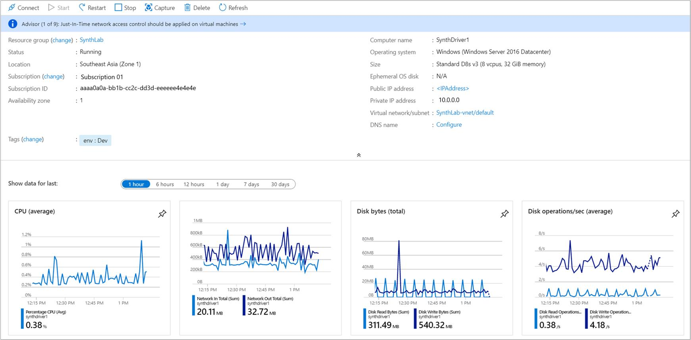
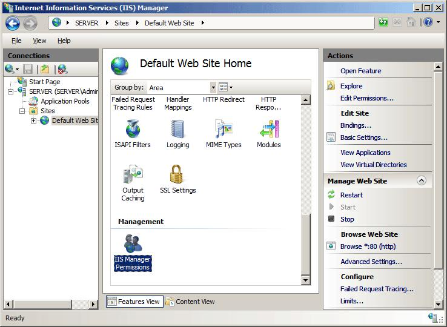
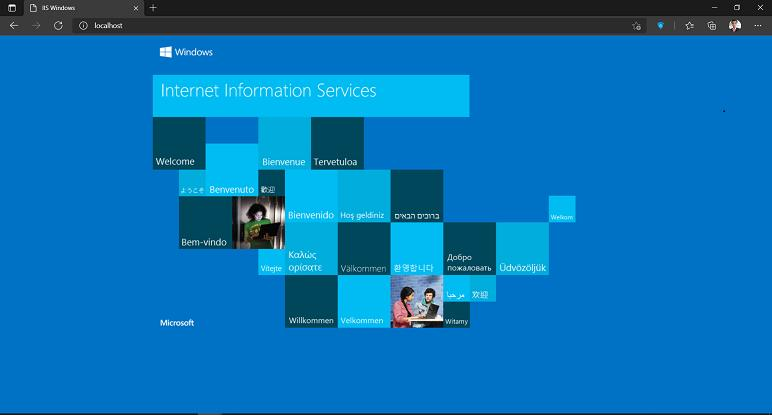

# IIS Deployment on Azure VM

This project demonstrates IIS web server deployment and monitoring on an Azure Virtual Machine.

## Features
- Azure Windows VM Setup
- IIS Installation
- Website Hosting
- Basic Monitoring
- IIS Service Management
- Infrastructure Health Checks

## Technologies Used
- Microsoft Azure
- Windows Server
- IIS (Internet Information Services)
- PowerShell

## Deployment Steps
1. Create Azure Windows VM
2. Open RDP Port (3389)
3. Connect to VM
4. Install IIS
5. Deploy Sample Website
6. Configure Firewall
7. Verify Website Access

## IIS Commands Used

Restart IIS:
```powershell
iisreset
```

Check IIS Service:
```powershell
Get-Service W3SVC
```

## Monitoring Activities
- CPU Monitoring
- Memory Usage Monitoring
- IIS Service Health Check
- Website Availability Check

## Purpose
This project was created to learn cloud infrastructure deployment, IIS hosting, and SRE monitoring concepts.

## Screenshots

### Azure Portal


### IIS Manager


### Website Running
